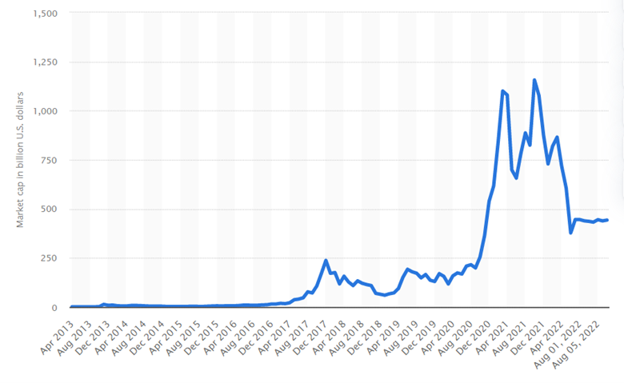
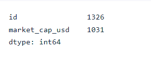
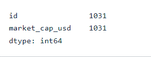
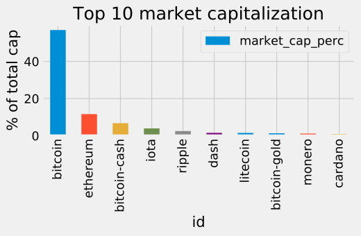
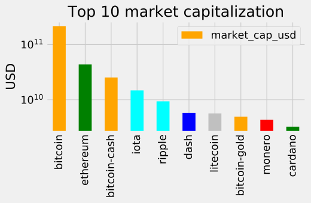
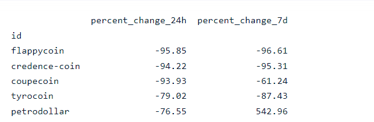
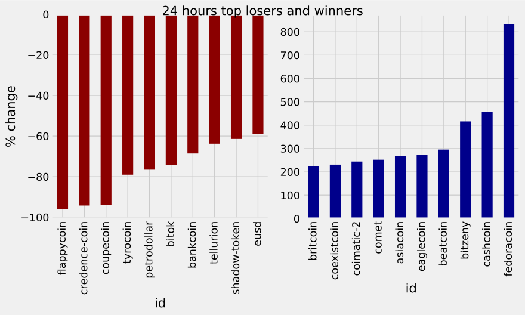
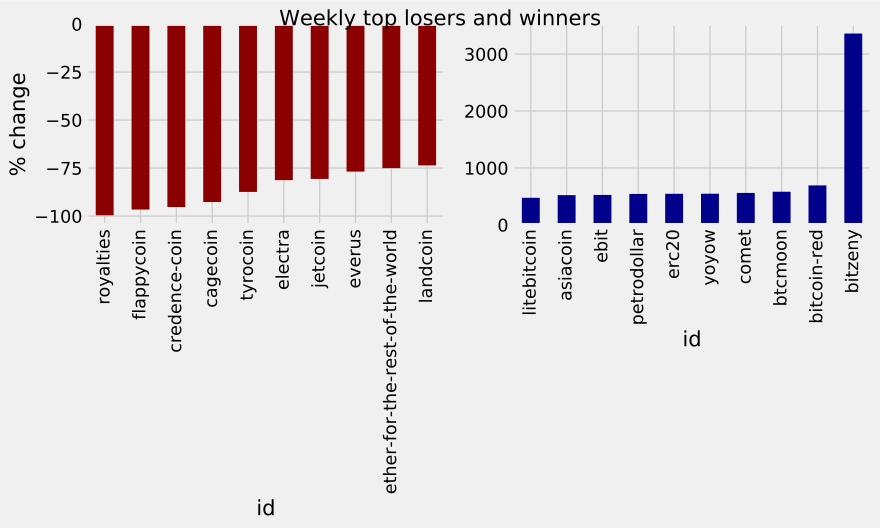
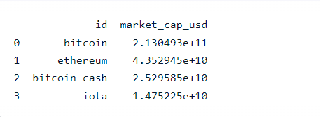

> # Bitcoin and Cryptocurrencies Analysis

> ## Content
>Since the launch of Bitcoin in 2008, hundreds of similar projects based on blockchain technology have emerged. they call these cryptocurrencies (also coins or cryptos in the internet slang). Some are extremely valuable nowadays, and others may have the potential to become extremely valuable in the future. In fact, on the 5th of August 2022, Bitcoin has a market capitalization above $400 billion.
>
>
>
>That said, let's get to business. We tried to get an up-to-date dataset, but unfortunately, we only found a dataset up to the end of 2017, otherwise, we need to pay for the up-to-date dataset. We will start with a CSV we downloaded on the internet named coinmarketcap_06122017.csv.

> #### We downloaded the dataset from "kaggle.com": [Click here](https://github.com/bpkaur/Exploring-the-Bitcoin-cryptocurrency-market/blob/master/datasets/coinmarketcap_06122017.csv)
>
> #### We have exploded the dataset by using Pandas-Profiling and investigated, cleaned, and manipulated the data: [Click here](https://walmalki.github.io/bitcoin_and_cryptocurrencies_exploratory/)

> ## Discovering & Cleaning the Data
>
> #### Importing pandas
>
> import pandas as pd
>
> #### Importing matplotlib
>
> `import matplotlib.pyplot as plt`
>
> #### Reading datasets/coinmarketcap_06122017.csv into pandas
>
> `dec6 = pd.read_csv('datasets/coinmarketcap_06122017.csv')`
>
> #### Selecting the 'id' and the 'market_cap_usd' columns
>
> `market_cap_raw = dec6[['id', 'market_cap_usd']]`
>
> #### Counting the number of values
>
> `print(market_cap_raw.count())`
>
> 
>
> The count for id and market_cap_usd differ above? It is because some cryptocurrencies have no known market capitalization, this is represented by NaN in the data, and NaNs are not counted. These cryptocurrencies are of little interest to us in this analysis, so they are safe to remove.
>
> #### Filtering out rows without a market capitalization
>
> `cap = market_cap_raw.query('market_cap_usd > 0')`
>
> #### Counting the number of values again
>
> `print(cap.count())`
>
> 

> ## Questions
>
> 1. What cryptocurrency is dominating in the market captalization?
> 2. What is going on?! volatility in cryptocurrency.
> 3. Buying random coins, is it a right decision?

> ## Answering the questions
>
> 1. To answer the question **What cryptocurreny is dominating in the market captalization?**, we will plot the market capitalization for the top 10 coins as a barplot to better visualize this.
>
> #### Declaring these now for later use in the plots
>
> `TOP_CAP_TITLE = 'Top 10 market capitalization'`
>
> `TOP_CAP_YLABEL = '% of total cap'`
>
> #### Selecting the first 10 rows and setting the index
>
> `cap10 = cap.head(10).set_index(cap.id[:10])`
>
> #### Calculating market_cap_perc
>
> `cap10 = cap10.assign(market_cap_perc = lambda x: (x.market_cap_usd / cap.market_cap_usd.sum()) * 100)`
>
> #### Plotting the barplot with the title defined above
>
> `ax = cap10.plot.bar(x='id', y='market_cap_perc', title=TOP_CAP_TITLE)`
>
> #### Annotating the y axis with the label defined above
>
> `ax.set_ylabel(TOP_CAP_YLABEL)`
> 
> 
>
> The plot above is informative enough. Bitcoin is too big, and the other coins are hard to distinguish because of this. Instead of the percentage, We will use a log scale of the "raw" capitalization. Plus, we will use color to group similar coins and make the plot more informative.
>
> #### Colors for the bar plot
>
> `COLORS = ['orange', 'green', 'orange', 'cyan', 'cyan', 'blue', 'silver', 'orange', 'red', 'green']`
>
> #### Plotting market_cap_usd as before but adding the colors and scaling the y-axis
>
> `ax = cap10.plot.bar(x='id', y='market_cap_usd', logy=True, color=COLORS, title=TOP_CAP_TITLE)`
>
> #### Annotating the y axis with 'USD'
>
> `ax.set_ylabel('USD')`
>
> #### Removing the xlabel as it is not very informative
>
> `ax.set_xlabel('')`
>
> 

> 2. To answer the question **What is going on?! volatility in cryptocurrency.**, The cryptocurrencies market has been spectacularly volatile since the first exchange opened. Let's explore this volatility! We will begin by selecting and plotting the 24 hours and 7 days percentage change.
>
> #### Selecting the id, percent_change_24h and percent_change_7d columns
>
> `volatility = dec6[['id' ,'percent_change_24h', 'percent_change_7d']]`
>
> #### Setting the index to 'id' and dropping all NaN rows
>
> `volatility = volatility.set_index('id').dropna()`
>
> #### Sorting the DataFrame by percent_change_24h in ascending order
>
> `volatility = volatility.sort_values('percent_change_24h', ascending=True)`
>
> #### Checking the first few rows
>
> `print(volatility.head())`
>
> 
>
> The table indicates that we can lose a lot of money quickly on cryptocurrencies. We will plot the top 10 biggest gainers and top 10 losers cryptocurrency in market capitalization.
>
> #### Defining a function with 2 parameters, the series to plot and the title
>
> `def top10_subplot(volatility_series, title):`
>
> #### Making the subplot and the figure for two side by side plots
>
> `fig, axes = plt.subplots(nrows=1, ncols=2, figsize=(10, 6))`
>    
> #### Plotting with pandas the barchart for the top 10 losers
>
> `ax = (volatility_series[:10].plot.bar(color='darkred', ax=axes[0]))`
>    
> #### Setting the figure's main title to the text passed as parameter
>   
> `fig.suptitle(title)`
>
> #### Setting the ylabel to '% change'
>
> `ax.set_ylabel('% change')`
>
> #### Same as above, but for the top 10 winners
>
> `ax = (volatility_series[-10:].plot.bar(color='darkblue', ax=axes[1]))`
>
> #### Returning this
>
> `return fig, ax`
>
> `DTITLE = "24 hours top losers and winners"`
>
> #### Calling the function above with the 24 hours period series and title DTITLE
>
> `fig, ax = top10_subplot(volatility.percent_change_24h, DTITLE)`
>
> 
>
> The two plots above show cryptocurrencies **decrease** *in red color* and **increase** *in blue color* during the 24 hours, Fedoracoin in the blue plot for instance, appear to be 800% daily increase. On the other hand, the red plot shows how much value some cryptocurrencies lose in such short periods of time.

> 3. To answer the question **Buying random coins, is it a right decision?**, we will reuse the function defined above to see what is going weekly instead of daily.
>
> #### Sorting in ascending order
>
> `volatility7d = volatility.sort_values('percent_change_7d', ascending=True)`
>
> `WTITLE = "Weekly top losers and winners"`
>
> #### Calling the top10_subplot function
>
> `fig, ax = top10_subplot(volatility7d.percent_change_7d, WTITLE)`
>
> 
>
>The two plots demonstrates that there is a considerable fluctuation between the 1 and 7 days percentage changes. As with stocks, and many other financial products, the smaller the capitalization, the bigger the risk and reward. Smaller cryptocurrencies are less stable projects in general, and therefore even riskier investments than the bigger ones. So, buying a random coin is not a right decision, we need to investigate more by first finding out about their capitalization in market.
>
> #### Selecting everything bigger than 10 billion 
>
> `largecaps = cap.query('market_cap_usd > 10000000000')`
>
> #### Printing out largecaps
>
> `print(largecaps)`
>
> 

> ### Final result
>
> 1. What cryptocurrency is dominat in the market capitalization?
>
> The cryptocurrency that dominates in the market capitalization is **Bitcoin** despite it is under serious competition from other projects, but it is still dominant in market capitalization.
>
> 2. What is going on?! volatility in cryptocurrency.
>
> The cryptocurrencies market has been spectacularly volatile since the first exchange opened. The market of cryptocurrenies is fluctuating rapidly, and we can lose a lot of money quickly on cryptocurrencies. the reason is that for their small market capitalization, the Smaller cryptocurrencies are less stable projects in general.
>
> 3. Buying random coins, is it a right decision?
>
> Investing in a random coins is not a right decision, becuase as we mentioned in the previous answer to question 2, cryptocurrencies are not considered as stable projects in general, for this we might lose a lot of money if we aren't careful about choosing the right investments.
