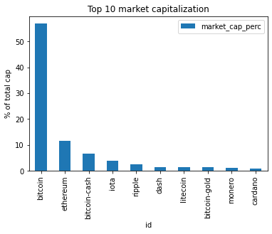
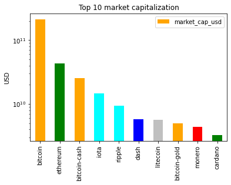

> # Bitcoin and Cryptocurrencies Analysis

> ## Content
>Since the launch of Bitcoin in 2008, hundreds of similar projects based on blockchain technology have emerged. they call these cryptocurrencies (also coins or cryptos in the internet slang). Some are extremely valuable nowadays, and others may have the potential to become extremely valuable in the future. In fact, on the 5th of August 2022, Bitcoin has a market capitalization above $400 billion.
>
>
>
>That said, let's get to business. We tried to get an up-to-date dataset, but unfortunately, we only found a dataset up to the end of 2017, otherwise, we need to pay for the up-to-date dataset. We will start with a CSV we downloaded on the internet named coinmarketcap_06122017.csv.

> #### We downloaded the dataset from "kaggle.com": [Click here](https://www.kaggle.com/datasets/kingabzpro/crypto)
>
> #### We have exploded the dataset by using Pandas-Profiling and investigated, cleaned, and manipulated the data: [Click here](https://walmalki.github.io/bitcoin_and_cryptocurrencies/)

> ## Data Summary
>
> #### Importing pandas
>
> import pandas as pd
>
> #### Importing matplotlib
>
> `import matplotlib.pyplot as plt`
>
> #### Reading datasets/coinmarketcap_06122017.csv into pandas
>
> `dec6 = pd.read_csv('datasets/coinmarketcap_06122017.csv')`
>
> #### Selecting the 'id' and the 'market_cap_usd' columns
>
> `market_cap_raw = dec6[['id', 'market_cap_usd']]`
>
> #### Counting the number of values
>
> `print(market_cap_raw.count())`
>
> 
>
> #### The count for id and market_cap_usd differ above? It is because some cryptocurrencies have no known market capitalization, this is represented by NaN in the data, and NaNs are not counted. These cryptocurrencies are of little interest to us in this analysis, so they are safe to remove.
>
> #### Filtering out rows without a market capitalization
>
> `cap = market_cap_raw.query('market_cap_usd > 0')`
>
> #### Counting the number of values again
>
> `print(cap.count())`
>
> 

> ## Questions
>
> 1. What cryptocurreny is dominating in the market captalization?
>  

> ## Answering the questions
>
> 1. To answer the question **What cryptocurreny is dominating in the market captalization?**, we will plot the market capitalization for the top 10 coins as a barplot to better visualize this.
>
> #### Declaring these now for later use in the plots
>
> `TOP_CAP_TITLE = 'Top 10 market capitalization'`
> `TOP_CAP_YLABEL = '% of total cap'`
>
> #### Selecting the first 10 rows and setting the index
>
> `cap10 = cap.head(10).set_index(cap.id[:10])`
>
> #### Calculating market_cap_perc
>
> `cap10 = cap10.assign(market_cap_perc = lambda x: (x.market_cap_usd / cap.market_cap_usd.sum()) * 100)`
>
> #### Plotting the barplot with the title defined above
>
> `ax = cap10.plot.bar(x='id', y='market_cap_perc', title=TOP_CAP_TITLE)`
>
> #### Annotating the y axis with the label defined above
>
> `ax.set_ylabel(TOP_CAP_YLABEL)`
> 
> 
>
> The plot above is informative enough. Bitcoin is too big, and the other coins are hard to distinguish because of this. Instead of the percentage, We will use a log scale of the "raw" capitalization. Plus, we will use color to group similar coins and make the plot more informative.
>
> #### Colors for the bar plot
>
> `COLORS = ['orange', 'green', 'orange', 'cyan', 'cyan', 'blue', 'silver', 'orange', 'red', 'green']`
>
> #### Plotting market_cap_usd as before but adding the colors and scaling the y-axis
>
> `ax = cap10.plot.bar(x='id', y='market_cap_usd', logy=True, color=COLORS, title=TOP_CAP_TITLE)`
>
> #### Annotating the y axis with 'USD'
>
> `ax.set_ylabel('USD')`
>
> #### Removing the xlabel as it is not very informative
>
> `ax.set_xlabel('')`
>
> 