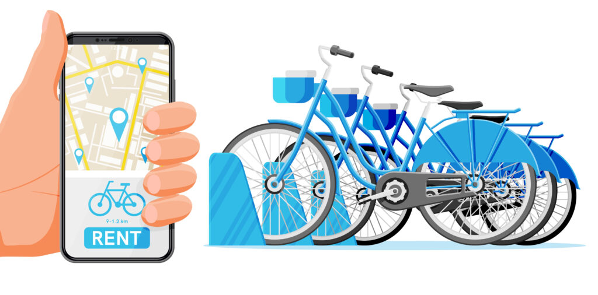
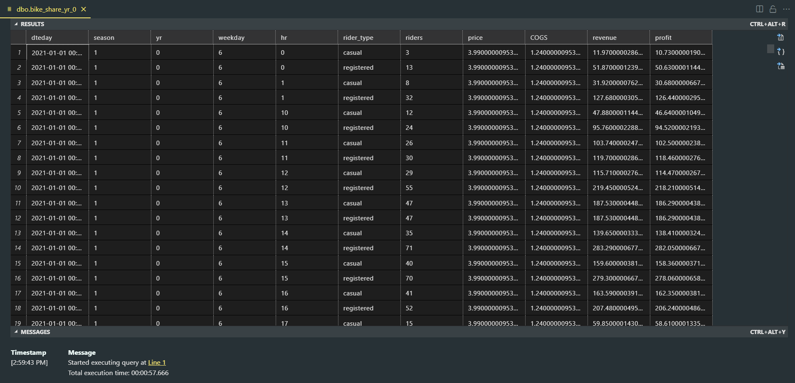
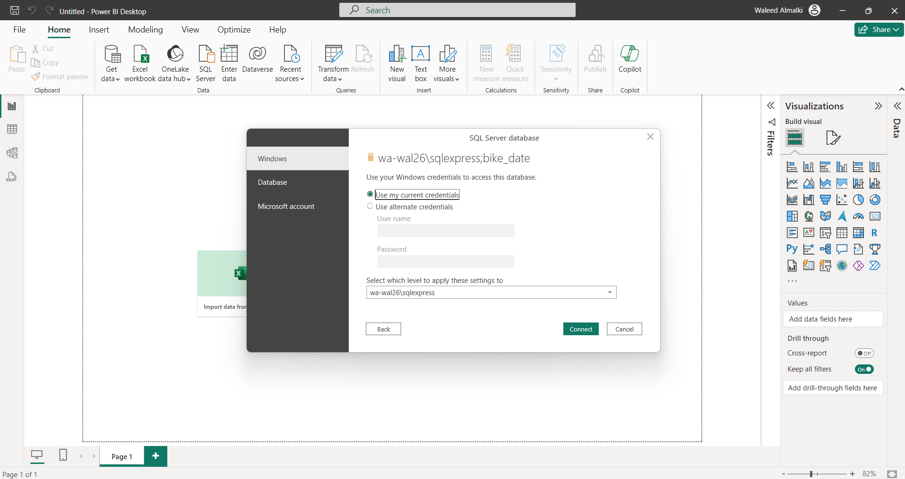
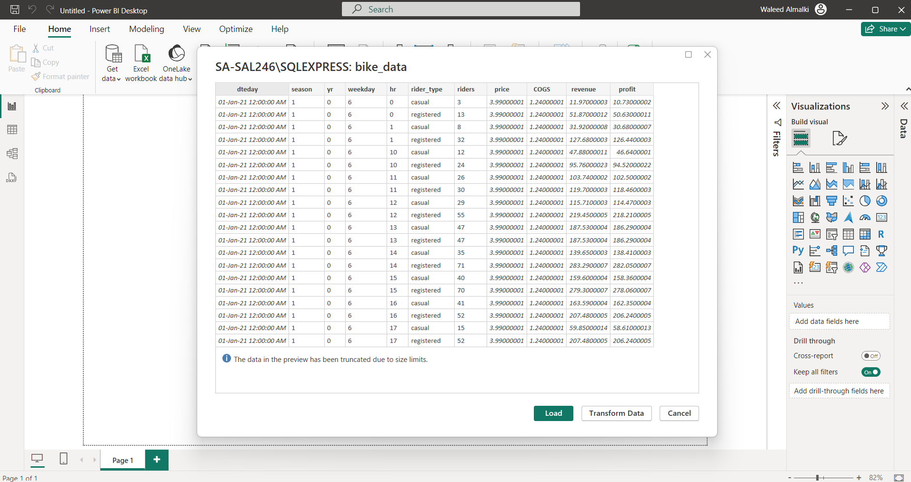
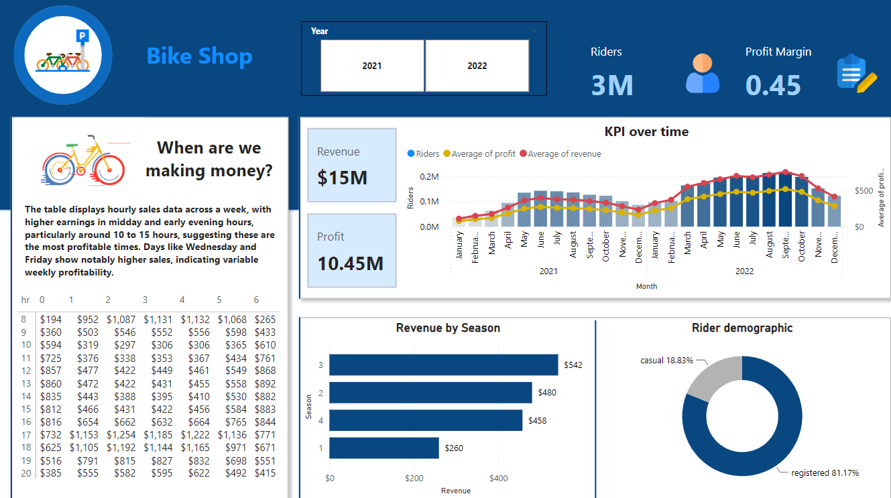
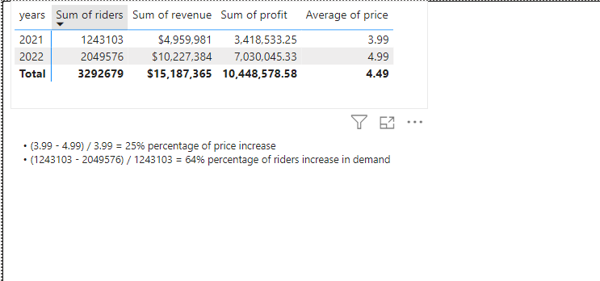

> # Bike Share

 ## Content
This project aims to analyze a dataset of a Bike Share compnay and help to understand if increasing prices next year is possible.

> ## Purposes of the project
> 1. Building a Dataset.
> 2. Developing SQL queries.
> 3. Connecting Microsoft Power BI to the dataset.
> 4. Building a Dashboard.
> 5. Making Analysis Recommendations.

> ## Data Collection and Preparation
> We collected the data from [**kaggle.com**](https://www.kaggle.com/datasets/walmalki/toman-bike-share-dataset) and started building our database in Microsoft SQL Server and Visual Studio Code, we have three tables of data (bike_share_yr_0, bike_share_yr_1, cost_table) and we developed a SQL query to join the tables togather as shown in the screenshot below:
> 
> 

> Our dataset as shown in the screenshot below:
> 
> 

> ## Connecting Microsoft Power BI to the dataset.
> After we built our dataset, we connected it with Microsoft Power BI.
>
> 
>
> 
>
> Loading the dataset into MS Power BI
>
> 
>

># Power BI dashboard:
>
> 

> ## Recommendations
> ### Conservative Increase:
> Considering the substantial increase last year, a more conservative increase might be prudent to avoid hitting a price ceiling where demand starts to drop. An increase in the range of 10-15% could test the market's response without risking a significant loss of customers.
>
> ### Price setting:
> - If the price in 2022 was $4.99, a 10% increase would make the new price about $5.49.
> - A 15% increase would set the price at approximately %5.74.
>
> 
>
> ### Recommended Strategy:
> #### - Market Analysis: 
> Conduct further market research to understand customer satisfaction, potential competitive changes, and the overall economic environment. This can quide whether leaning towards the lower or higher end of the suggested increase.
>
> #### - Segmented Pricing Strategy:
> Consider different pricing for casual versus registered users, as they may have different price sensitivties.
>
> ### - Monitor and Adjust:
> Implement the new prices but be ready to adjust based on immediate customer feedback and sales data. Monitoring closely will allow you to fine-tune your pricing strategy without committing fully to a price that might turn out to be too high.