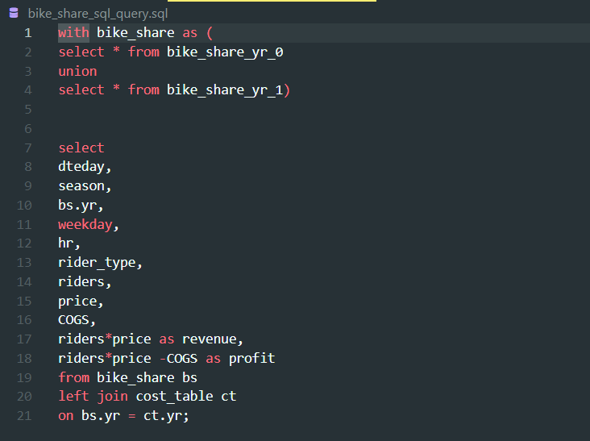

> # Bike Share

> ## Content
> You will analyze the dataset and help a Bike Share compnay to understand if increasing prices next year is possible.
>
> 

> ## Process
> 1. Building a Database
> 2. Developing SQL queries 
> 3. Connect Power BI to the database
> 4. Build a Dashboard 
> 5. Make Analysis Recommendations

> ### First:
> Creating a database in Microsoft SQL Server and Visual Studio Code , we have three tables of data (bike_share_yr_0, bike_share_yr_1, cost_table) and we developed a SQL query to join the tables togather as shown below:
> 
> 
>
>
> 
>
>
>
> 
>
>
>
> 
>
>
>
> 
>
>
>
> 
>
>
>