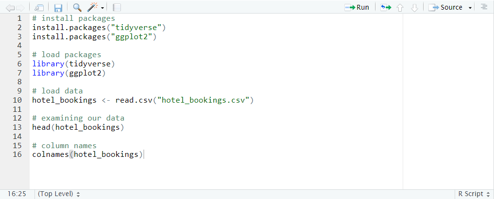
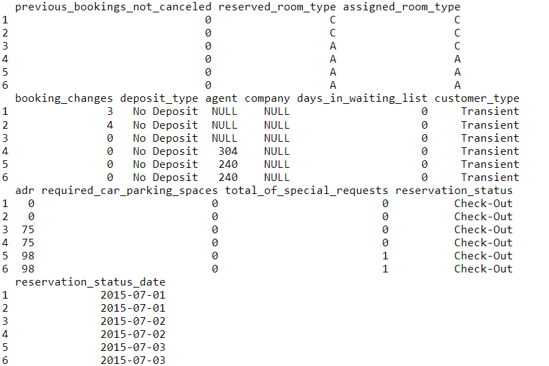

> # Hotel Bookings Analysis

> ## Content
This data describes a dataset with hotel demand data, which contains 31 variables and 79,330 observations for City Hotel and 40,060 observations for Resort Hotel. Each observation represents a hotel booking between the 1st of July 2015 and the 31st of August 2017.

### I downloaded the dataset from "Kaggle.com": [Click here](https://www.kaggle.com/datasets/mojtaba142/hotel-booking)

### We have exploded the dataset by using Pandas-Profiling and investigated, cleaned, and manipulated the data.

> ## Questions to answer
1. Do people with children have to book in advance?
2. What group of guests are booking the most weekend nights in order to target that group in a new marketing campaign?

> **## Hypothesis**
1. Yes, people with children tend to book in advance.
2. Guests without children book the most weekend nights. Is this true?

> **##Analyzing the Data**

We decided to use R-Studio to analyze our data, as R-Studio is a free software environment plus is friendly to use.

First of all, we will install the packages which we need for our analyses, then we import our data.

 

