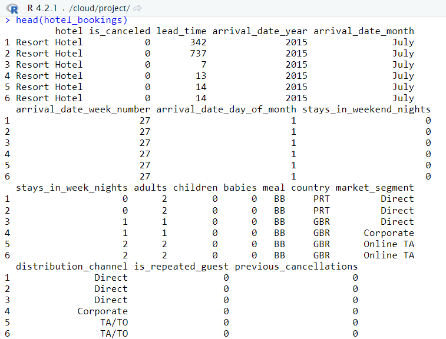
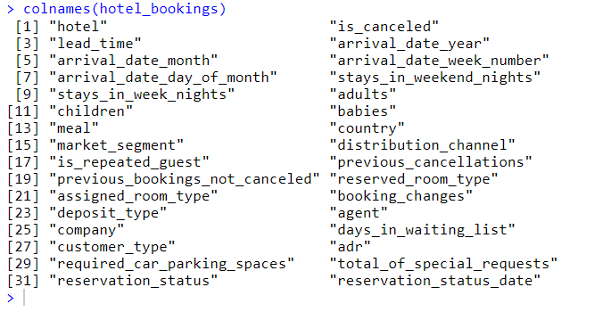
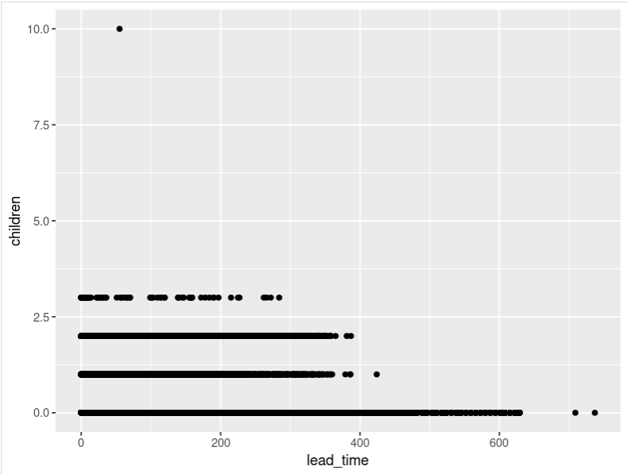
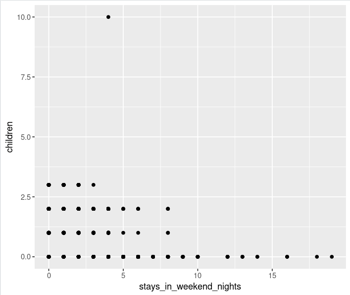

> # Hotel Bookings Analysis

> ## Content
This data describes a dataset with hotel demand data, which contains 31 variables and 79,330 observations for City Hotel and 40,060 observations for Resort Hotel. Each observation represents a hotel booking between the 1st of July 2015 and the 31st of August 2017.

> ### We downloaded the dataset from "Kaggle.com": [Click here](https://www.kaggle.com/datasets/mojtaba142/hotel-booking)

#### We have exploded the dataset by using Pandas-Profiling and investigated, cleaned, and manipulated the data: [Click here]()

> ## Questions to answer
1. Do people with children have to book in advance?
2. What group of guests are booking the most weekend nights?

> ## Hypothesis
1. Yes, people with children tend to book in advance.
2. Guests without children book the most weekend nights. Is this true?

> ## Analyzing the Data

#### We decided to use R-Studio to analyze our data, as R-Studio is a free software environment plus is friendly to use.

#### First of all, we will install the packages which we need for our analyses, then we import our data.

> #### Install packages

`install.packages("tidyverse")`

> #### Load packages

`library(tidyverse)`

> #### import dataset

`hotel_bookings <- read.csv("hotel_bookings.csv")`

> #### We look at a sample of our data.

> #### We look at column names.

> ### Answering question one

To answer the first question which is **Do people with children have to book in advance**, we will create a visualization to see how true that statement is or isn't.

We will use the ggplot2 package to create our visualization, however, the two columns that we should include in our plot to find the answer to this question are **lead_time** as the x-axis and **children** as the y-axis.

`install.packages("ggplot")'

`library(ggplot)'

`ggplot(data = hotel_bookings) + geom_point(mapping = aes(x=lead_time, y=children))`

On the x-axis, the plot shows how far in advance a booking is made, with the bookings furthest to the right happening the most in advance. On the y-axis it shows how many children there are in a party. So, the plot reveals that our hypothesis is **incorrect**, many of the advanced bookings are being made by people with 0 children.

> ### Answering question two

The second question is **What group of guests are booking the most weekend nights?** and will create a visualization as we did for the first question. The two variables that need to provide to the plot are **stays_in_weekend_nights** as the x-axis and **children** as the y-axis.

`ggplot(data = hotel_bookings) + geom_point(mapping = aes(x=stays_in_weekend_nights, y=children))`

On the x-axis, the plot shows that what group of guests are booking the most weekend nights, with the stay in weekend nights furthest to the right happening the most booking weekend nights. the y-axis shows how many children there are in a party. So, the plot reveals that our hypothesis is **correct**, guests without children book most weekend nights.